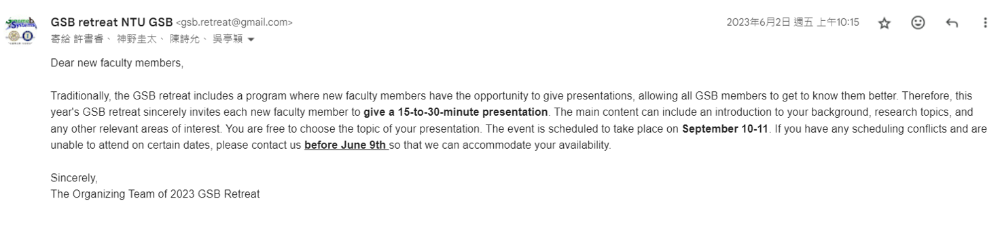

Members: 胡昱庭 (Yu-Ting  Hu) and 謝雨彤 (Yu-Tung Hsieh)

Google Drive: [Public Relations](https://drive.google.com/drive/folders/1Ck5u7ps8WYyGMOASCpvzt14xAPH7pndD){:target='_blank'}

### Special Talk Invitation (before 6/20)

#### Description

1. Invite new faculty members (王維樂、林暐翔、邱澗庚、林耿慧、鄭佳宜) and Dean of College of Life Science (江伯倫) to give talks. 
2. Might be better to send emails to each person individually.
3. The talk will be roughly 25 minutes long.

Last year:

### Participation Survey (Google Form) (before 6/20)

#### Description

1. Google form for surveying participation (Questions + Introduction to GSB Retreat)
2. Two versions (Faculty and Student) 

> Notes:  
1. Add `Seafood` option to dietary restrictions.  
2. Faculty: Add an additional page to survey how many family members the teacher will bring, what kind of room (Twin room, triple room, or Quad room) they need, and whether they want a room for themselves and not share with others.  
3. Student: Add abstract submission deadline (Late Augest? TBD)

Example:   
[Faculty_2023](https://docs.google.com/forms/d/1Gt7w2GYe9vHuPnsnKXDDWpVSlJxxsypvwLJ2exzN0wA/edit){:target="_blank"}  
[Student_2023](https://docs.google.com/forms/d/1FawO30bPDruC5qD4COu2C1-BMTyBExGXHI0E3nMGqgk/edit){:target="_blank"}  
[New_student_2023](https://docs.google.com/forms/d/1fpcW_gdKX5AeGhhOmKWcie5HS_RZg3-4I5lgiu4HcY0/edit){:target="_blank"}  

<!-- * Survey
* Announcement
* Everything related to emails? -->