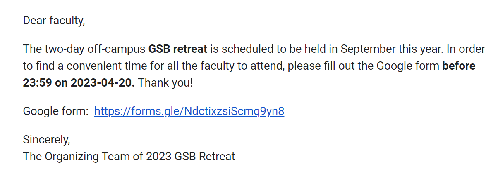

Members: 胡昱庭 (Yu-Ting  Hu) and 謝雨彤 (Yu-Tung Hsieh)

Google Drive: [Public Relations](https://drive.google.com/drive/folders/1Ck5u7ps8WYyGMOASCpvzt14xAPH7pndD){:target='_blank'}

### Google Form and Email (before 3/27)

#### Description

1. Google form for surveying suitable dates (maybe survey both faculty and students) ([example_2023](https://docs.google.com/forms/d/13xNKIX3fb0mFbysdHmSrDtq-HpiIt3c46iXFReHKVIo/edit){:target="_blank"})
    * Current potential dates: **9/22-9/23**, **9/29-9/30**, **10/6-10/7**

2. Email content

    - Example:
    
<!-- * Survey
* Announcement
* Everything related to emails? -->